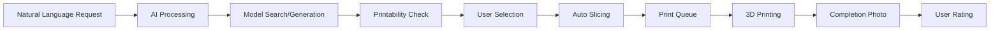

# Replicator

> Making 3D printing as simple as asking for what you need

Replicator is an intelligent 3D printing system that allows users to request objects using natural language and automatically handles the entire printing workflow—from understanding the request to delivering the finished object. Just tell it what you want, and it will find or generate a 3D model, prepare it for printing, and manage the entire print process.

## ✨ Features

### 🗣️ Natural Language Interface
- Request objects in plain English: *"I need a small red phone stand"*
- Automatic parameter extraction (size, color, material, quality)
- Intelligent clarification questions for ambiguous requests
- User preference learning for improved future requests

### 🔍 Intelligent Model Sourcing
- **Sketchfab Integration**: Search thousands of existing 3D models
- **AI Model Generation**: Create custom models when existing ones aren't suitable
- **Printability Assessment**: Ensure all models are actually printable before presenting options
- Always provides 5 high-quality, printable options to choose from

### 🖨️ Automated Print Management
- **Smart Slicing**: Automatic G-code generation with optimized settings
- **Queue Management**: Handle multiple print requests efficiently
- **Real-time Monitoring**: Live progress updates and camera feed
- **Failure Detection**: Automatic print failure detection and notification

### 📱 User-Friendly Interface
- Clean web interface designed for non-technical users
- Real-time print status dashboard with live camera feed
- Complete print history with photos of finished objects
- Mobile-responsive design for remote monitoring

### ⭐ Quality Feedback System
- Rate completed prints on multiple dimensions
- Continuous system improvement based on user feedback
- Learning algorithms to improve model selection and generation

## 🏗️ Architecture

### Frontend
- **Vue.js** web application with real-time WebSocket updates
- Progressive web app capabilities
- Responsive design optimized for desktop and tablet

### Backend
- **Multi-agent architecture** built with LangChain
- **RESTful API** for frontend communication
- **Specialized agents** for each aspect of the workflow:
  - Request Parser Agent (NLP processing)
  - Model Search Agent (Sketchfab integration)
  - Model Generation Agent (AI model creation)
  - Printability Assessment Agent (print feasibility)
  - Print Controller Agent (hardware interface)
  - And 7 more specialized agents

### External Integrations
- **Sketchfab API**: 3D model search and retrieval
- **OctoPrint API**: Printer control and monitoring
- **PrusaSlicer**: G-code generation and slicing
- **AI Model Generation Service**: On-demand 3D model creation

## 🚀 Quick Start

### Prerequisites
- 3D printer with OctoPrint installed
- Node.js 18+ for frontend
- Python 3.8+ for backend
- PostgreSQL database

### Installation

1. **Clone the repository**
   ```bash
   git clone https://github.com/yourusername/replicator.git
   cd replicator
   ```

2. **Set up the backend**
   ```bash
   cd backend
   pip install -r requirements.txt
   cp .env.example .env
   # Configure your environment variables
   python manage.py migrate
   python manage.py runserver
   ```

3. **Set up the frontend**
   ```bash
   cd frontend
   npm install
   npm run dev
   ```

4. **Configure integrations**
   - Set up OctoPrint connection
   - Configure Sketchfab API key
   - Set up AI model generation service

## 🔄 How It Works



1. **Request**: User describes what they want in natural language
2. **Processing**: AI agents parse the request and extract specifications
3. **Sourcing**: System finds existing models or generates new ones
4. **Assessment**: All models are checked for printability
5. **Selection**: User chooses from 5 printable options
6. **Preparation**: Automatic slicing and G-code generation
7. **Printing**: Automated print management with real-time monitoring
8. **Completion**: Photo capture and user feedback collection

## 📊 Database Schema

The system uses PostgreSQL with the following main tables:
- `users` - User accounts and preferences
- `print_requests` - Natural language requests and parsed parameters
- `models` - 3D model metadata and printability scores
- `prints` - Print jobs and their status
- `ratings` - User feedback and quality ratings
- `print_queue` - Print job scheduling and prioritization

## 🛠️ Development

### Project Structure
```
replicator/
├── backend/                 # LangChain-based API and agents
│   ├── agents/             # Specialized AI agents
│   ├── api/                # REST API endpoints
│   ├── integrations/       # External service integrations
│   └── models/             # Database models
├── frontend/               # Vue.js web application
│   ├── src/
│   │   ├── components/     # Vue components
│   │   ├── views/          # Page views
│   │   └── services/       # API service layer
└── docs/                   # Documentation
```

### Contributing
1. Fork the repository
2. Create a feature branch
3. Make your changes
4. Add tests for new functionality
5. Submit a pull request

## 📈 Success Metrics

- **User Experience**: 90%+ NLP accuracy, 80%+ print success rate
- **Performance**: <3s web interface load, <10s search results
- **Reliability**: 99%+ uptime, robust error recovery
- **Usability**: Accessible to non-technical users

## 🔮 Future Roadmap

- **Multi-printer support** for increased throughput
- **Advanced materials** (multi-color, specialty filaments)
- **Mobile app** for enhanced remote monitoring
- **Social features** for sharing prints and requests
- **Machine learning** improvements for better request interpretation
- **E-commerce integration** for automatic material ordering

## 📄 License

This project is licensed under the MIT License - see the [LICENSE](LICENSE) file for details.

## 🤝 Support

- Documentation: [docs/](docs/)
- Issues: [GitHub Issues](https://github.com/yourusername/replicator/issues)
- Discussions: [GitHub Discussions](https://github.com/yourusername/replicator/discussions)

---

*"Make it so." - Jean-Luc Picard*
