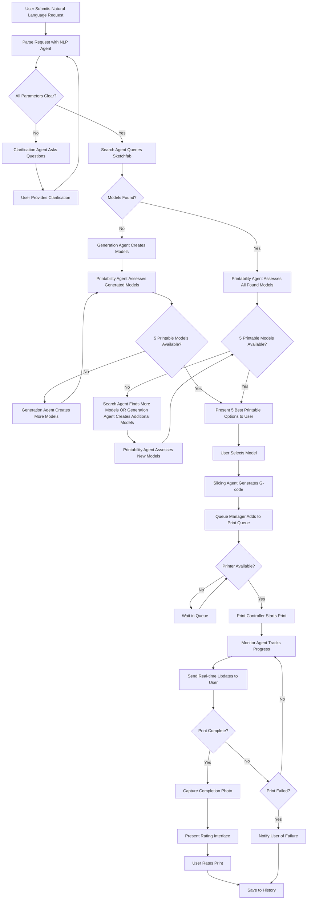

# Replicator - Product Requirements Document

## Project Overview

**Product Name:** Replicator  
**Vision Statement:** Enable general consumers to request and automatically print 3D objects using natural language, making 3D printing as simple as asking for what you need.

**Product Description:**  
Replicator is an intelligent 3D printing system that allows users to request objects using natural language and automatically handles the entire printing workflow—from understanding the request to delivering the finished object. The system combines AI-powered natural language processing, 3D model sourcing and generation, and automated print management to create a seamless "Star Trek replicator" experience.

## Target Users

**Primary User:** General consumers with little to no 3D printing knowledge who want to create physical objects without understanding the technical complexities of 3D printing.

**User Characteristics:**
- Minimal technical expertise with 3D printing
- Comfortable with web applications
- Wants quick, simple solutions for creating physical objects
- Values convenience over technical control

## Core Requirements

### 1. Natural Language Request Processing

**Functional Requirements:**
- Accept natural language requests for objects (e.g., "I need a small red phone stand")
- Parse and understand object specifications including:
  - Object type/category
  - Size requirements (small, medium, large, or specific dimensions)
  - Material preferences
  - Color preferences
  - Quality/detail requirements
- Handle ambiguous requests by asking clarifying questions
- Automatically determine unspecified parameters when possible
- Store user preferences to improve future request interpretation

**Content Filtering:**
- Implement content filtering to prevent inappropriate object requests
- Block copyrighted material requests
- Maintain a blacklist of prohibited items

### 2. Object Sourcing and Generation

**Sketchfab Integration:**
- Search Sketchfab API for suitable 3D models based on parsed request
- Filter results by printability criteria
- Present up to 5 relevant options to user with preview images
- Allow user to select preferred option or request alternatives

**AI Model Generation:**
- Generate multiple 3D model options when suitable models are not found on Sketchfab
- Continue generating models until combined with Sketchfab results, 5 printable options are available
- Work in conjunction with Printability Assessment Agent to ensure generated models meet printing standards
- Ensure all generated models meet printability requirements before presenting to users
- Provide preview of generated models before user selection

**Printability Assessment:**
- Evaluate 3D models for FDM printing compatibility
- Check for:
  - Overhangs requiring support
  - Wall thickness adequacy
  - Overall structural integrity
  - Size compatibility with printer bed
- Provide printability rating (Good, Fair, Needs Modification)

### 3. Print Preparation and Slicing

**Slicing Integration:**
- Integrate with PrusaSlicer or similar slicing software
- Apply appropriate print settings based on:
  - Material type
  - Object complexity
  - Quality requirements
  - User preferences
- Generate G-code optimized for the connected printer
- Estimate print time and material usage

### 4. Print Management and Monitoring

**OctoPrint Integration:**
- Send G-code to printer via OctoPrint API
- Monitor print status in real-time
- Capture periodic photos during printing process
- Handle print queue management for multiple requests

**Print Control:**
- Allow users to cancel prints in progress
- Provide print pause/resume functionality
- Display real-time print progress and estimated completion time

**Failure Handling:**
- Detect print failures through OctoPrint monitoring
- Notify users of failed prints
- Provide failure reason when determinable
- Log failed prints for user reference

### 5. User Interface and Experience

**Web Application (Vue.js Frontend):**
- Clean, intuitive interface suitable for non-technical users
- Natural language input field for object requests
- Real-time print status dashboard showing:
  - Current print progress
  - Print queue status
  - Live camera feed from printer
  - Estimated completion time
- Object preview and selection interface
- Print history with photos of completed objects
- User preferences management

**Real-time Updates:**
- WebSocket connection for live print status updates
- Progress notifications throughout the printing process
- Visual indicators for each stage of the workflow

### 6. Notification System

**In-App Notifications:**
- Print completion alerts
- Print failure notifications
- Clarification requests for ambiguous object requests
- Queue status updates

**Notification Types:**
- Success: Print completed successfully with photo
- Failure: Print failed with reason and suggested actions
- Action Required: User input needed to proceed
- Status: General progress updates

### 7. Data Management and History

**User Data Storage:**
- Print history with request details, outcome photos, and user ratings
- User preferences for materials, sizes, and quality settings
- Saved object configurations for repeat printing
- Print statistics and usage metrics
- User feedback and rating history

**Request History:**
- Searchable history of all object requests
- Status tracking for each request (pending, printing, completed, failed)
- Ability to reprint previous objects
- Photos of completed prints
- User ratings and feedback for completed prints

### 8. User Feedback and Rating System

**Print Rating Interface:**
- Present rating interface immediately after print completion notification
- Allow users to rate completed objects on a 5-star scale
- Provide optional text feedback for specific comments
- Include categories for rating:
  - Overall satisfaction
  - Print quality
  - Accuracy to request
  - Usefulness of object
- Save ratings to improve future recommendations and model selection

**Feedback Utilization:**
- Use ratings to improve AI model generation quality
- Weight Sketchfab search results based on similar object ratings
- Identify common issues through rating patterns
- Provide feedback to model generation systems for continuous improvement

## Technical Architecture

### Frontend (Vue.js Web Application)
- Responsive web interface optimized for desktop and tablet use
- Real-time communication with backend via WebSocket
- Photo gallery for print history and previews
- Progressive web app capabilities for better user experience

### Backend API and Agentic System (LangChain)
- RESTful API for frontend communication
- Natural language processing pipeline for request interpretation
- Integration with external APIs (Sketchfab, OctoPrint)
- AI model generation capabilities
- Print queue management system
- Notification service

### External Integrations
- **Sketchfab API:** 3D model search and retrieval
- **OctoPrint API:** Printer control and monitoring
- **PrusaSlicer:** G-code generation and slicing
- **AI Model Generation Service:** On-demand 3D model creation

### Data Storage
- User preferences and settings
- Print history and metadata
- Object request logs
- Print queue state
- Generated and cached 3D models

## Database Schemas

### Users Table
```sql
CREATE TABLE users (
    id UUID PRIMARY KEY,
    created_at TIMESTAMP DEFAULT CURRENT_TIMESTAMP,
    updated_at TIMESTAMP DEFAULT CURRENT_TIMESTAMP,
    preferences JSONB DEFAULT '{}'
);
```

### Print Requests Table
```sql
CREATE TABLE print_requests (
    id UUID PRIMARY KEY,
    user_id UUID REFERENCES users(id),
    original_request TEXT NOT NULL,
    parsed_parameters JSONB,
    status VARCHAR(50) DEFAULT 'pending',
    created_at TIMESTAMP DEFAULT CURRENT_TIMESTAMP,
    updated_at TIMESTAMP DEFAULT CURRENT_TIMESTAMP,
    completed_at TIMESTAMP,
    INDEX idx_user_status (user_id, status),
    INDEX idx_created_at (created_at)
);
```

### Models Table
```sql
CREATE TABLE models (
    id UUID PRIMARY KEY,
    source_type VARCHAR(20) NOT NULL, -- 'sketchfab', 'generated'
    source_id VARCHAR(255),
    file_path VARCHAR(500) NOT NULL,
    preview_image_path VARCHAR(500),
    metadata JSONB,
    printability_score DECIMAL(3,2),
    printability_notes TEXT,
    created_at TIMESTAMP DEFAULT CURRENT_TIMESTAMP,
    INDEX idx_source (source_type, source_id)
);
```

### Prints Table
```sql
CREATE TABLE prints (
    id UUID PRIMARY KEY,
    request_id UUID REFERENCES print_requests(id),
    model_id UUID REFERENCES models(id),
    user_id UUID REFERENCES users(id),
    gcode_file_path VARCHAR(500),
    status VARCHAR(50) DEFAULT 'queued',
    print_settings JSONB,
    estimated_duration INTEGER, -- minutes
    actual_duration INTEGER, -- minutes
    material_used DECIMAL(6,2), -- grams
    started_at TIMESTAMP,
    completed_at TIMESTAMP,
    failure_reason TEXT,
    completion_photo_path VARCHAR(500),
    created_at TIMESTAMP DEFAULT CURRENT_TIMESTAMP,
    updated_at TIMESTAMP DEFAULT CURRENT_TIMESTAMP,
    INDEX idx_user_status (user_id, status),
    INDEX idx_request (request_id),
    INDEX idx_completed_at (completed_at)
);
```

### Ratings Table
```sql
CREATE TABLE ratings (
    id UUID PRIMARY KEY,
    print_id UUID REFERENCES prints(id),
    user_id UUID REFERENCES users(id),
    overall_rating INTEGER CHECK (overall_rating >= 1 AND overall_rating <= 5),
    print_quality_rating INTEGER CHECK (print_quality_rating >= 1 AND print_quality_rating <= 5),
    accuracy_rating INTEGER CHECK (accuracy_rating >= 1 AND accuracy_rating <= 5),
    usefulness_rating INTEGER CHECK (usefulness_rating >= 1 AND usefulness_rating <= 5),
    text_feedback TEXT,
    created_at TIMESTAMP DEFAULT CURRENT_TIMESTAMP,
    UNIQUE(print_id) -- One rating per print
);
```

### Print Queue Table
```sql
CREATE TABLE print_queue (
    id UUID PRIMARY KEY,
    print_id UUID REFERENCES prints(id),
    queue_position INTEGER NOT NULL,
    priority INTEGER DEFAULT 0,
    created_at TIMESTAMP DEFAULT CURRENT_TIMESTAMP,
    INDEX idx_queue_position (queue_position),
    INDEX idx_priority_position (priority DESC, queue_position)
);
```

### Model Options Table
```sql
CREATE TABLE model_options (
    id UUID PRIMARY KEY,
    request_id UUID REFERENCES print_requests(id),
    model_id UUID REFERENCES models(id),
    option_rank INTEGER,
    selected BOOLEAN DEFAULT FALSE,
    presented_at TIMESTAMP DEFAULT CURRENT_TIMESTAMP,
    INDEX idx_request (request_id),
    INDEX idx_request_rank (request_id, option_rank)
);
```

### System Logs Table
```sql
CREATE TABLE system_logs (
    id UUID PRIMARY KEY,
    level VARCHAR(10) NOT NULL, -- 'info', 'warning', 'error'
    message TEXT NOT NULL,
    context JSONB,
    print_id UUID REFERENCES prints(id),
    request_id UUID REFERENCES print_requests(id),
    created_at TIMESTAMP DEFAULT CURRENT_TIMESTAMP,
    INDEX idx_level (level),
    INDEX idx_created_at (created_at),
    INDEX idx_print (print_id),
    INDEX idx_request (request_id)
);
```

## Functional Workflows

### Flow Diagram



### Primary Workflow: Object Request to Completion
1. User submits natural language request
2. System parses request and identifies missing parameters
3. System asks clarifying questions if needed
4. System searches Sketchfab for suitable models
5. If models found: Present options to user for selection
6. If no models found: Generate AI model based on request
7. Assess printability of selected/generated model
8. Configure slicing parameters and generate G-code
9. Add to print queue and begin printing when ready
10. Monitor print progress and provide real-time updates
11. Capture completion photo and notify user
12. Save print record to user history

### Secondary Workflow: Print Management
1. User views print queue and current status
2. User can cancel, pause, or modify queued prints
3. System handles print failures with appropriate notifications
4. System manages multiple requests in queue order

### Tertiary Workflow: History and Preferences
1. User reviews print history with photos and details
2. User can reprint previous objects
3. User manages preferences for future prints
4. System learns from user choices to improve recommendations

## Success Criteria

**User Experience Metrics:**
- User can successfully request and receive printed objects with minimal technical knowledge
- Average time from request to print start is under 10 minutes for existing models
- Print success rate exceeds 80% for appropriately sized objects
- User satisfaction with print quality meets expectations based on request

**System Performance Metrics:**
- Natural language processing accuracy above 90% for common object types
- Printability assessment accuracy above 85%
- System uptime above 99% during normal operation hours
- Real-time status updates delivered within 5 seconds of state changes

## Non-Functional Requirements

**Performance:**
- Web interface loads within 3 seconds
- Object search results returned within 10 seconds
- Real-time updates delivered with minimal latency
- System supports concurrent processing of requests

**Reliability:**
- Graceful handling of printer disconnections
- Robust error recovery for failed prints
- Data persistence across system restarts
- Backup and recovery capabilities for user data

**Security:**
- Content filtering to prevent inappropriate requests
- Input validation for all user requests
- Secure API communications
- User data protection and privacy

**Usability:**
- Interface accessible to users with minimal technical knowledge
- Clear error messages and guidance
- Intuitive navigation and workflow
- Mobile-responsive design for monitoring capabilities

## Future Considerations

**Potential Enhancements:**
- Multi-printer support for increased throughput
- Advanced material support (multi-color, specialty filaments)
- Integration with additional 3D model repositories
- Machine learning improvements for request interpretation
- Mobile app for remote monitoring
- Social features for sharing prints and requests
- Integration with e-commerce for automatic material ordering

**Scalability Considerations:**
- Multi-user support with authentication
- Cloud-based model generation and storage
- Distributed printing network capabilities
- Advanced queue management for high-volume usage

## Backend Agent Architecture

The Replicator system utilizes a multi-agent architecture built with LangChain to handle the complex workflow from natural language processing to print completion. Each agent has specialized responsibilities and can communicate with other agents as needed.

### Suggested Agent List

#### 1. Request Parser Agent
**Purpose:** Natural language processing and request interpretation  
**Responsibilities:**
- Parse user's natural language requests
- Extract object type, specifications, and preferences
- Identify missing or ambiguous parameters
- Maintain context across clarification conversations
- Store parsed parameters in structured format

**Tools:** LangChain NLP tools, custom parsing functions, parameter validation

#### 2. Clarification Agent
**Purpose:** Handle ambiguous requests and gather missing information  
**Responsibilities:**
- Generate intelligent clarifying questions
- Manage multi-turn conversations for parameter collection
- Prioritize which missing parameters are most critical
- Validate user responses and update request parameters
- Know when sufficient information has been gathered

**Tools:** Question generation templates, conversation state management, parameter validation

#### 3. Model Search Agent
**Purpose:** Find suitable 3D models from external sources  
**Responsibilities:**
- Query Sketchfab API with parsed parameters
- Continue searching until sufficient printable models are found
- Filter and rank search results by relevance
- Work with Printability Assessment Agent to validate models before user presentation
- Handle API rate limiting and error responses
- Cache search results for performance
- Coordinate with Generation Agent when insufficient printable models are found

**Tools:** Sketchfab API integration, search optimization algorithms, caching mechanisms

#### 4. Model Generation Agent
**Purpose:** Create 3D models when existing ones aren't suitable  
**Responsibilities:**
- Generate AI model variations as needed to reach 5 total printable options
- Continue generation until printability requirements are met
- Work closely with Printability Assessment Agent to ensure models are printable
- Create preview images for generated models
- Optimize models for 3D printing constraints during generation
- Handle generation failures gracefully and retry with different parameters
- Coordinate with Search Agent to determine how many additional models are needed

**Tools:** AI model generation APIs, 3D model processing libraries, image generation tools

#### 5. Printability Assessment Agent
**Purpose:** Evaluate 3D models for printing feasibility before user selection  
**Responsibilities:**
- Analyze model geometry for printing issues before models are shown to users
- Check for overhangs, thin walls, and structural problems
- Assign printability scores and filter out unprintable models
- Work continuously with Search and Generation Agents until 5 printable options are available
- Consider printer-specific limitations
- Rank printable models by quality score for optimal user presentation
- Ensure users never see models that cannot be successfully printed

**Tools:** 3D model analysis libraries, printing simulation tools, geometric analysis algorithms

#### 6. Slicing Agent
**Purpose:** Convert 3D models to printer instructions  
**Responsibilities:**
- Configure slicing parameters based on model and preferences
- Generate G-code using PrusaSlicer or similar tools
- Optimize print settings for quality and speed
- Calculate material usage and time estimates
- Handle slicing errors and parameter adjustments

**Tools:** PrusaSlicer API, slicing parameter optimization, G-code validation

#### 7. Queue Manager Agent
**Purpose:** Manage print job scheduling and prioritization  
**Responsibilities:**
- Add jobs to print queue with appropriate priority
- Handle queue reordering and cancellations
- Manage queue when printer becomes available
- Provide queue status updates to users
- Handle queue persistence across system restarts

**Tools:** Database queue management, priority algorithms, job scheduling logic

#### 8. Print Controller Agent
**Purpose:** Interface with 3D printer hardware  
**Responsibilities:**
- Send G-code to printer via OctoPrint API
- Handle printer connection and communication issues
- Manage print start/stop/pause/resume commands
- Monitor printer status and connectivity
- Handle hardware-specific error conditions

**Tools:** OctoPrint API integration, printer communication protocols, error handling

#### 9. Print Monitor Agent
**Purpose:** Track print progress and detect issues  
**Responsibilities:**
- Monitor print progress in real-time
- Capture periodic photos during printing
- Detect print failures and anomalies
- Calculate remaining time and progress percentages
- Generate status updates for user interface

**Tools:** OctoPrint monitoring APIs, image processing for failure detection, progress calculation

#### 10. Notification Agent
**Purpose:** Handle all user communications and alerts  
**Responsibilities:**
- Send real-time updates to web interface
- Generate completion notifications with photos
- Handle failure notifications with context
- Manage notification preferences and timing
- Queue notifications when user is offline

**Tools:** WebSocket connections, notification templating, message queuing

#### 11. Rating Collection Agent
**Purpose:** Gather and process user feedback  
**Responsibilities:**
- Present rating interfaces at appropriate times
- Collect multi-dimensional ratings (quality, accuracy, etc.)
- Process and store user feedback
- Generate insights from rating patterns
- Trigger follow-up questions when needed

**Tools:** Rating interface generation, feedback analysis, data storage

#### 12. Learning and Optimization Agent
**Purpose:** Improve system performance based on historical data  
**Responsibilities:**
- Analyze user ratings and feedback patterns
- Optimize model search and generation parameters
- Improve printability assessment accuracy
- Refine slicing parameter selection
- Update recommendation algorithms

**Tools:** Machine learning libraries, data analysis tools, parameter optimization

### Agent Communication Patterns

**Sequential Processing:** Most agents work in a defined sequence (Parser → Search/Generation → Assessment → Slicing → Queue → Print → Monitor → Rating)

**Parallel Processing:** Some agents can work simultaneously (Search Agent and Generation Agent can both explore options)

**Event-Driven Communication:** Agents respond to events (print completion triggers Monitor Agent to notify Notification Agent)

**Feedback Loops:** Learning Agent receives data from all other agents to improve system performance

**Error Handling:** Each agent can communicate failures to appropriate recovery agents or escalate to user notification

This multi-agent architecture provides modularity, scalability, and clear separation of concerns while enabling complex workflows and intelligent decision-making throughout the print process.